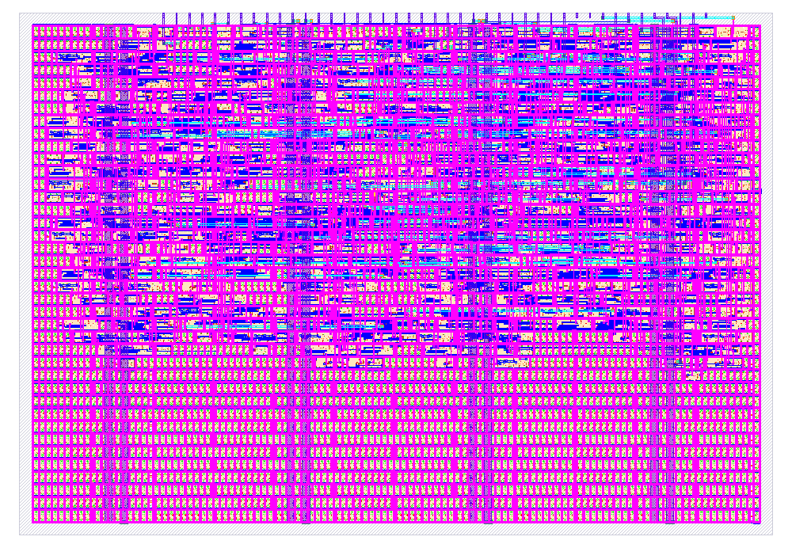

# TT09 / Sky130 Dual-Port SRAM Implementation

A physical ASIC implementation of a parameterized synchronous dual-port SRAM core, hardened on the SkyWater 130nm (`sky130A`) process node using the Tiny Tapeout flow and OpenLane 2 / OpenROAD.

For complete RTL architectural specifications, parameters, and full behavioral implementations of the memory core, refer to the primary repository:  
👉 **[github.com/AnandNag003/moola_dp_sram](https://github.com/AnandNag003/moola_dp_sram)**

---

## Architectural Adaptation for Tiny Tapeout

Because Tiny Tapeout standard tiles use standard-cell synthesis rather than custom analog SRAM compiler macros, the memory array is synthesized directly from discrete D-type flip-flops (`dfxtp`) and combinational multiplexer trees. 

To integrate `moola_dp_sram` into the single $1\times 1$ tile budget ($\approx 167\,\mu\text{m} \times 108\,\mu\text{m}$), the following adaptations were made:

* **Capacity Sizing:** Configured the core to $16 \text{ words} \times 8 \text{ bits}$ ($128 \text{ storage bits}$).
* **Synthesis Cleansing:** Stripped simulation-only SystemVerilog constructs (`$readmemh`, file path string parameters) so the file elaborates cleanly in Yosys.
* **Top-Level Wrapper (`tt_um_moola_sram`):** Mapped memory controls onto the fixed Tiny Tapeout 24-pin harness:
  * `ui_in[3:0]`: Port A Address (`addr_a[3:0]`)
  * `ui_in[4]`: Port A Clock Enable (`en_a`)
  * `ui_in[5]`: Port A Write Enable (`we_a`)
  * `ui_in[6]`: Port B Clock Enable (`en_b`)
  * `uio_in[7:0]`: Port A Write Data Input (`wdata_a[7:0]`)
  * `uo_out[7:0]`: Port A Synchronous Read Data Output (`rdata_a[7:0]`)
  * `uio_oe[7:0]`: Set to `0x00` (configuring bidirectional pins as inputs)

---

## Verification

* **Pre-Layout (RTL):** Verified using Cocotb and Icarus Verilog (`-g2012`). The testbench (`test/test.py`) applies inputs and samples synchronous read outputs on `FallingEdge(dut.clk)` to eliminate race conditions.
* **Post-Layout (Gate-Level):** Verified against the synthesized standard-cell netlist (`gate_level_netlist.v`) with Sky130 primitives and timing annotations.

---

## Physical Implementation & Signoff Metrics

The design was hardened cleanly using the automated OpenLane 2 / OpenROAD ASIC flow.

### Summary Metrics

| Metric | Result | Status |
| :--- | :--- | :--- |
| **PDK / Node** | SkyWater 130nm (`sky130A`) | Complete |
| **Tile Area Allocation** | $1 \times 1$ Tile | Fit |
| **Core Utilization** | **$48.20\%$** (`design__instance__utilization`) | Optimal |
| **Functional Cell Count** | **569 cells** (excluding fill and well taps) | Clean |
| **Total Standard Cells** | **3,262 cells** (including fill and taps) | Clean |
| **Total Wire Length** | **$15,205\,\mu\text{m}$** | Routed |
| **DRC Violations** | **0 errors** (Magic & KLayout) | Passed |
| **LVS Violations** | **0 errors** | Passed |
| **Antenna Violations** | **0 errors** (1 diode inserted) | Passed |
| **Worst Setup Slack (WNS)** | **$+10.17\,\text{ns}$** (SS corner, $100^\circ\text{C}$, $1.60\,\text{V}$) | Closed |
| **Worst Hold Slack (WHS)** | **$+0.138\,\text{ns}$** (FF corner, $-40^\circ\text{C}$, $1.95\,\text{V}$) | Closed |
| **Peak Calculated IR Drop** | **$70.9\,\mu\text{V}$** ($< 0.004\%$ of $1.8\,\text{V}$) | Minimal |

### Standard Cell Breakdown

* **Flip-Flops (`dfxtp`):** 136 cells (128 array storage bits + 8 registered output bits)
* **Multiplexers (`mux2`, `mux4`):** 160 cells (read address decode and bit selection)
* **Clock Buffers & Timing Repair:** 181 timing-repair buffers (including 128 hold-repair buffers) + 25 clock buffers
* **Physical / Fill Cells:** 2,468 fill/decap cells + 225 well tap cells

---

## Silicon Layout Preview

